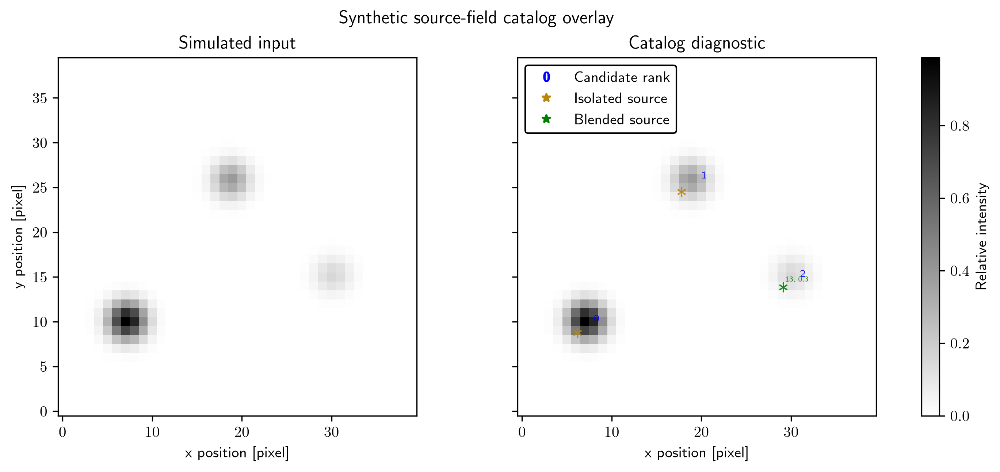
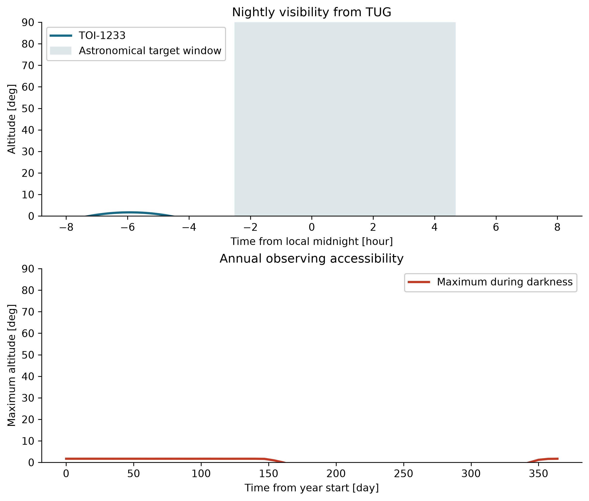
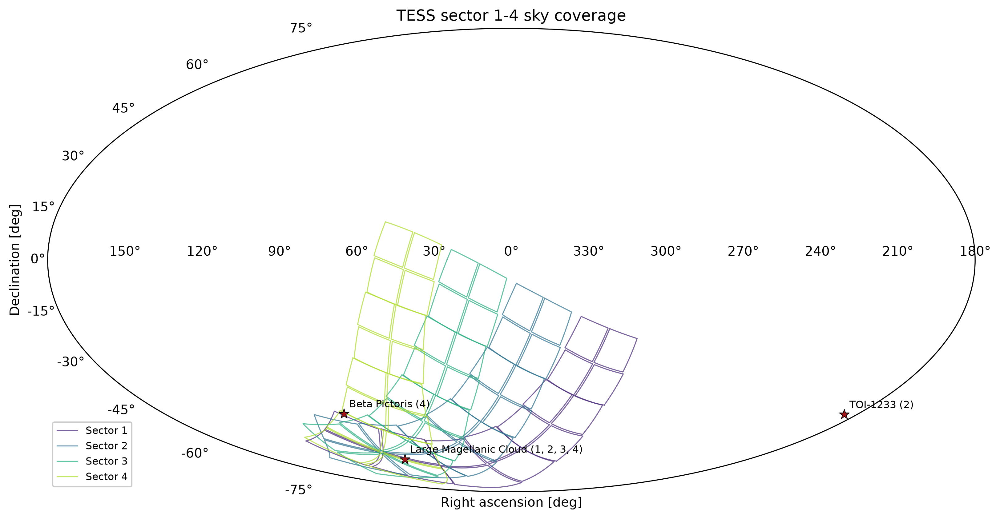
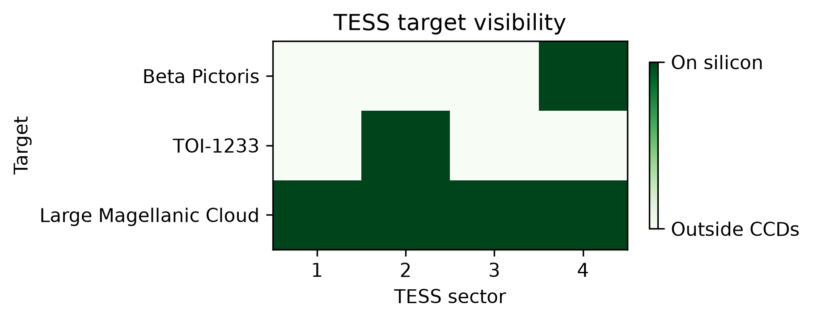
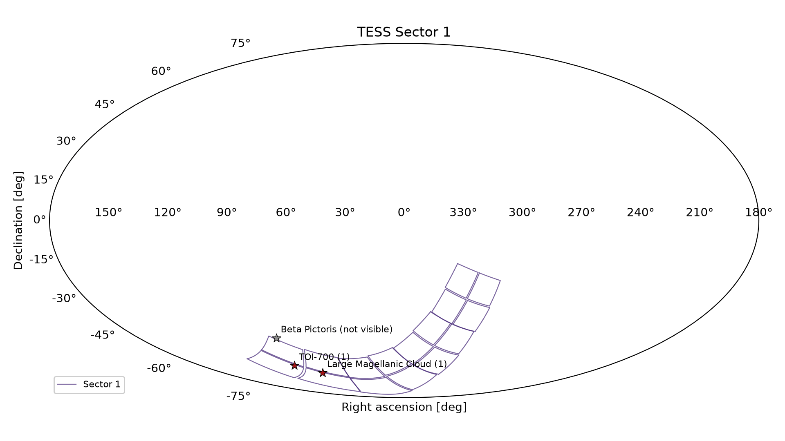
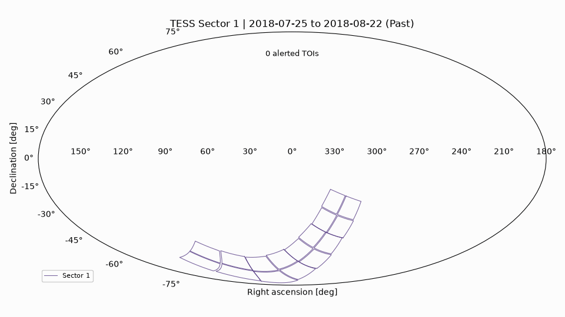

# TDpy numerical and visualization utilities

## Purpose

TDpy provides numerical, plotting, and path-handling utilities for astrophysical analysis. Users can normalize environment-based data paths, transform scientific arrays, annotate source catalogs, and create reproducible diagnostic figures from simulated or observed data.

The functions are designed for direct use in scripts, notebooks, and larger analysis pipelines.

## What it provides

The library includes utilities for:

- environment-based filesystem and data-path normalization;
- reusable plotting helpers for population and catalog diagnostics;
- numerical support for array handling and scientific transforms;
- light-weight visualization utilities used across time-domain and catalog workflows;
- reproducible output layout for figures and intermediate diagnostic products.

## Scientific utilities

- configure portable data and output paths;
- annotate source catalogs and visualize population parameters;
- inspect intermediate analysis states with diagnostic plots;
- apply general numerical transforms used in astronomical analyses.
- build periodic-event timing and overlap reports with `tdpy.astro`;
- calculate interval contrasts and render atmosphere forecast figures with `tdpy.exoplanet`;
- construct normalized NIRSpec calculations with `tdpy.pandeia`;
- run labeled, fail-fast command sequences with `tdpy.workflow`.

## Installation

The repository supports a standard editable install:

```bash
cd tdpy
python -m pip install -e .
export TDPY_PATH=/path/to/tdpy
```

`TDPY_PATH` identifies the repository root. Runtime inputs belong under `data/` and generated pipeline outputs belong under `visuals/`. Both directories are ignored by Git. Dataset-specific helpers continue to use their established `*_DATA_PATH` variables.

## Console output

tdpy and the pipelines built on it (PCAT, miletos, ephesos, nicomedia, and the others in this ecosystem) print nothing by default, including progress bars and their own numerical warnings. Set `export TDPY_VERBOSITY=1` to restore progress messages, file narration, and warnings.

## Quick example

The synthetic example annotates a three-source catalog on a Gaussian image:

```bash
python examples/catalog_overlay_diagnostic.py --typefileplot png
```



This produces a two-panel figure showing a deterministic Gaussian source field before and after catalog annotation. The three sources have mean magnitudes of 11, 12, and 13 mag. Two are isolated and one is labeled as blended. These are clearly labeled simulated inputs rather than observational evidence.

## Catalog annotation

The calculation contains:

- input: synthetic catalog positions and magnitudes;
- transformation: catalog overlay plotting and annotation placement;
- output: a saved figure showing the diagnostic field view.

The side-by-side field views expose the catalog positions, magnitudes, blend labels, and annotation placement.

## Core plotting utilities

`tdpy.plot_catl()` overlays source positions, magnitudes, and annotations on image fields. Corner plots of parameter samples are drawn by PCAT; posterior sampling, including `pcat.fixed.sample_posterior`, lives in PCAT.

These routines can be called directly wherever an analysis needs consistent catalog annotations.

## Sampling boundary

TDpy provides numerical transforms and independent random variate generators such as `samp_gaustrun`, `samp_powr`, and `samp_dpow`. These functions draw directly from specified distributions and do not run Markov chain Monte Carlo (MCMC).

PCAT is the sole posterior sampler in this software ecosystem. Use:

- `pcat.sampling.sample()` for transdimensional catalog inference;
- `pcat.sampling.sample_fixed()` for a fixed-dimensional model;
- `pcat.sampling.sample_fixed_chains()` for multiple fixed-dimensional chains; and
- `pcat.sampling.sample_posterior()` for the dictionary-style interface formerly provided by TDpy.

TDpy does not expose `tdpy.mcmc`, `tdpy.samp`, or posterior-sampling compatibility wrappers. This keeps the dependency direction one-way because PCAT depends on TDpy for numerical utilities.

## Nightly and annual target visibility

`tdpy.astro.run_target_visibility_diagnostic()` computes a target's altitude and the Sun's altitude through one night, then samples the target's maximum altitude during darkness across a year. The output plot and arrays work for any observatory latitude, longitude, height, and target coordinates. The maintained [TOI-1233 example](examples/target_visibility/TargetVisibility.ipynb) uses the TUBITAK National Observatory and needs no network access. From the TDpy repository root, run:

```bash
python examples/target_visibility/run.py --target TOI-1233 --observatory TUG
```



## TESS sky coverage and visibility

`tdpy.tess` converts the Transiting Exoplanet Survey Satellite (TESS) mission pointing and detector World Coordinate Systems from `tesswcs` into reusable sky products. It provides:

- `tess_sector_footprints()` for the 16 camera/CCD boundaries in one sector;
- `target_is_visible()` and `tess_target_visibility()` for on-silicon checks;
- `plot_tess_sector_map()` and `plot_tess_sector_sequence()` for full-sky maps;
- `plot_tess_visibility()` for target-by-sector coverage matrices; and
- `animate_tess_sectors()` for fixed-frame full-sky GIFs over time.

Run the maintained example to draw quick static maps of Sectors 1--4 and a dated animation of all standard sectors 1--134:

```bash
python examples/tess_visibility/tess_visibility.py --sectors 1 2 3 4
```









The inputs are integer sector numbers and optional named International Celestial Reference System coordinates in degrees. The example highlights the real position of TOI-1233 and also marks Beta Pictoris and the Large Magellanic Cloud. Dates for Sectors 1--121 come from the `tesswcs` pointing table; the provisional dates and pointings for Sectors 122--134 come from [NASA's TESS observing schedule](https://heasarc.gsfc.nasa.gov/docs/tess/sector.html), recorded on October 1, 2026. `tesswcs` predicts camera geometry for future sectors from those published pointings. Frames distinguish past, in-progress, and planned sectors as of the rendering date. These markers illustrate sky coverage and do not represent new observations. Each target is transformed through all 16 sector CCD World Coordinate Systems and is visible only when its pixel coordinate falls on silicon.

The second animation shows the 8,148 TOI candidates in the [ExoFOP TESS TOI table](https://exofop.ipac.caltech.edu/tess/view_toi.php), using its **Date TOI Alerted (UTC)** and sky-position columns as downloaded on October 1, 2026. Each candidate first appears in the sector frame whose end date reaches its alert date; multiple candidates around one star overlap at the same sky position. TOI-1233 receives a separate red marker beginning with its 2019-08-26 alert. Future frames retain the TOIs already alerted as of the render date and do not imply future discoveries. The compact [TOI snapshot](examples/tess_visibility/toi_alerts.csv) makes offline reruns reproducible; `--refresh-tois` explicitly downloads an updated ExoFOP table.

Static figures are written directly under `examples/tess_visibility/visuals/`. The example also writes one map per requested static-map sector. Runtime and memory scale with the number of animated sectors; use `--animation-sectors 1 2 3 4` for a short development run. The footprint boundary follows nominal detector geometry in `tesswcs`; future pointings remain provisional, and the maps do not model scattered light, data-quality masks, cadence availability, or target-specific postage-stamp allocation.

## Data paths

TDpy normalizes environment-backed input and output paths with:

- `retr_pathbase()`
- `retr_pathenv()`
- `ensr_path()`
- `retr_path()`

These functions resolve data directories and create requested output directories without workstation-specific absolute paths.


